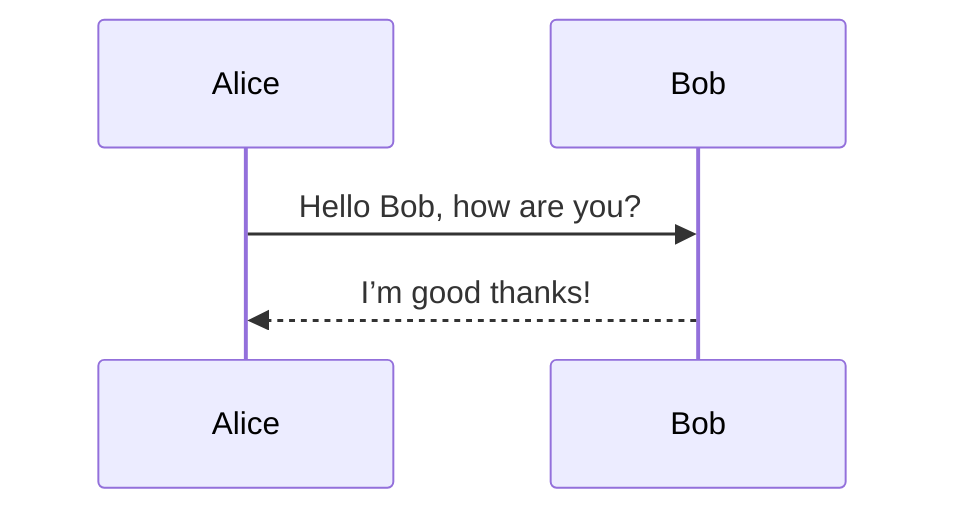

# Linuxの基礎知識

## UNIX系OS

### UNIXとは

UNIX（ユニックス）は、1969年にAT&Tベル研究所でケン・トンプソンとデニス・リッチーらによって開発されたオペレーティングシステム（OS）です。  

- **特徴**  
  - マルチユーザ／マルチタスクを標榜  
  - ファイルを中心に据えたシンプルな設計（“すべてはファイル”の哲学）  
  - テキスト処理やパイプによる小さなプログラムの組み合わせを重視  
- **歴史的意義**  
  - C言語で再実装されたことで移植性が飛躍的に向上  
  - 後の多くのOS設計に影響を与え、標準化（POSIX）につながった  

### Linuxとは

Linux（リナックス）は、1991年にリーナス・トーバルズが発表した**カーネル**（OSの中核部分）です。  

- **オープンソース**  
  - GPL（GNU General Public License）で公開され、誰でもソースコードを閲覧・改変・再配布可能  
- **カーネルとディストリビューション**  
  - **カーネル**: ハードウェア管理やプロセス管理を担う  
  - **ディストリビューション**: カーネルに各種ユーティリティやパッケージ管理システム、GUIなどを組み合わせた配布形態  
- **代表的ディストリビューション**  
  - **Ubuntu**: 初心者向け、Debian系  
  - **Red Hat Enterprise Linux (RHEL)**: 商用サポートあり  
  - **CentOS**: RHEL互換のコミュニティ版  
  - **その他**: Debian、Fedora、openSUSE など  

### 様々なUNIX系OSとPOSIX

- **UNIX系OSの広がり**  
  - **商用UNIX**: AIX（IBM）、HP‑UX（HPE）、Solaris（Oracle）など  
  - **BSD系**: FreeBSD、OpenBSD、NetBSD — オープンソース版UNIX  
  - **macOS**: Apple製OS。内部はBSD派生のDarwinをベースに独自GUIを搭載  
  - **Linux**: GPLベースで最も普及  
- **IEEE標準規格 POSIX**  
  - Portable Operating System Interfaceの略
  - UNIX系OS間の互換性を保つためのAPI／コマンド仕様  
- **本コースの位置づけ**  
  - 「Linux入門」という名称ですが、UNIX系OS全体の基礎を押さえることにもつながります。

## シェルの操作

### 様々なシェル

- `sh`（Bourne Shell）: POSIX 標準のベース  
- `bash`（Bourne Again Shell）: GNU プロジェクト版。広く普及  
- `zsh`: 高度な補完・カスタマイズ機能  
- `csh/tcsh`: C風の構文。現在はあまり主流ではない  

このコースでは最も一般的な `bash` を中心に、POSIX 準拠の共通機能を紹介。

### シェルを終了する `exit` / `Ctrl-D`

- `exit`: シェルを終了 (`exit 1`のように終了ステータスを渡すことも可能)
- `Ctrl-D`: 標準入力の EOF シグナルを送信 (対話型シェルを終了)
- `reset`: シェルを再起動する

### 実行中のコマンドを中断する `Ctrl-C`

- 終了までに長い時間がかかるコマンドを中断する場合、`Ctrl-C`を押すと強制終了可能

### Tab によるコマンド補完

部分入力後に Tab を押すと、ファイル名／コマンド名を自動補完される。
補完候補が複数ある場合は、再度 Tab で一覧表示が可能。

```bash
$ cd Doc<Tab>   # Documents/ などに補完
```

### Ctrl-R による履歴閲覧

- インクリメンタルサーチで過去のコマンドを呼び出し  
- `Ctrl-R` → 検索文字列入力 → 該当コマンドが表示  
- `Enter` で実行、`Ctrl-R` 再押下で次の候補  

```bash
(reverse-i-search)`ssh': ssh user@server.example.com
```

### シェル変数と環境変数

- **シェル変数**
  - `VAR=value` で定義。定義したシェル内のみ有効
- **環境変数**
  - `export VAR` で定義。子プロセスにも継承
  - 一覧表示: `env` または `printenv`

```bash
$ MYVAR=hello
$ echo $MYVAR
hello
$ bash -c 'echo $MYVAR'   # シェル変数は子プロセスで参照不能
                          # 何も出力されない
$ export MYVAR            # シェル変数を環境変数に
$ bash -c 'echo $MYVAR'   # 環境変数は子プロセスでも参照可能
hello
```

### 環境変数 PATH とコマンドの呼び出し

- `PATH` はコロン区切りのディレクトリリスト  
- シェルは左から順に実行ファイルを検索  
- 確認: `which <cmd>` / `which -a <cmd>` / `type <cmd>`  

```bash
$ echo $PATH
/usr/local/bin:/usr/bin:/bin:...

$ which python
/usr/bin/python

$ which -a python
/usr/bin/python
/usr/local/bin/python
```

### コマンドに別名をつける alias

- `alias name='command -options'` で短縮形を作成  
- `unalias name` で削除  

```bash
$ alias ll='ls -lah'
$ type ll
ll is aliased to `ls -lah`

$ ll
drwxr-xr-x 5 user user 4.0K Apr  7 10:00 .
```

### シェルの設定 `~/.bashrc`、`~/.bash_profile`

- `~/.bash_profile`（または `~/.profile`）  
  - **ログインシェル** 起動時に読み込まれる  
  - リモート SSH ログインやコンソールログイン時に適用  
- `~/.bashrc`  
  - **インタラクティブ非ログインシェル** 起動時に読み込まれる  
  - ターミナルエミュレータ（例: GNOME Terminal）や `bash` コマンド実行時に適用  

共通設定を両方で使いたい場合は、`~/.bash_profile` から `~/.bashrc` を呼び出す。

```bash
# ~/.bash_profile
if [ -f ~/.bashrc ]; then
  source ~/.bashrc
fi
```  

`~/.bashrc` に書く典型例。

```bash
# プロンプト設定
export PS1="\u@\h:\w\$ "

# エイリアス
alias ll='ls -lah'
alias gs='git status'

# 環境変数追加
export PATH="$HOME/bin:$PATH"

# エディタ設定
export EDITOR=vim
```  

- **反映方法**  
  - 編集後、既存ターミナルに反映するには `source ~/.bashrc` を実行
  - 新しいターミナルを開けば自動適用される
- **注意点**  
  - シェルごとに設定ファイルの名前・読み込み順序が異なる（例: zsh は `~/.zshrc`）  
  - 不要な設定や無限ループを作らないように、条件分岐や存在チェックを行うこと

## ヘルプとトラブルシューティング

### コマンドの使い方がわからない時に `man`, `<command> --help`

- `man <command>`: システムにインストールされているマニュアルページを表示します。  

```bash
man ls
```

- `<command> --help`: 簡易的な使い方やオプション一覧を表示します。  

```bash
ls --help
```

### エラーを読むくせをつける

- **エラーメッセージをまず自分で読む**  
  - 何が問題か（ファイルがない、権限がない、引数が不正 など）を把握  
- **検索エンジンやAIに質問**  
  - エラーメッセージ全文をコピーして検索  
  - セキュリティ情報（パスワード、鍵ファイルのパスなど）は含めない  
- **よく見るエラーは記憶しておく**  
  - 慣れてくると一目で原因が分かるようになります

### **演習**: エラーを出してみよう

**存在しないファイルへアクセス**

```bash
$ ls no_such_file.txt
ls: cannot access 'no_such_file.txt': No such file or directory
```

**存在しないコマンドを実行**

```bash
$ not_a_real_command
bash: not_a_real_command: command not found
```

**引数の不足するコマンド実行**

```bash
$ rm
rm: missing operand
```

**存在しないディレクトリへアクセス**

```bash
$ cd /no/such/dir
bash: cd: /no/such/dir: No such file or directory
```

**権限のないファイル操作**

```bash
$ touch test.txt
$ chmod 000 test.txt
$ cat test.txt
Permission denied
$ echo hoge >> test.txt
Permission denied
```



## ファイル・ディレクトリの操作

### Linux では「すべてはファイル」

Linuxでは、デバイスやプロセス情報、設定インタフェースなど、あらゆるリソースが「ファイル」として表現されます。

- 通常のファイルやディレクトリ
- `/dev/null` や `/dev/sda1`（デバイス）
- `/proc/cpuinfo`（CPU情報）
- ソケットファイルやパイプ

そのため、ファイル操作はLinuxにおいて本質的です。
一方で、直接ファイルを触ると煩雑でヒューマンエラーの危険があるため、実際にデバイスを扱う場合は専用のコマンドを使うことがほとんどです。

### ファイルの一覧を取得 `ls`

```bash
ls             # 現在のディレクトリの一覧
ls -l          # 詳細表示
ls -a          # 隠しファイル（.で始まる）を含めて表示
ls -lh         # サイズを人間に読みやすい単位で表示
```

### ワイルドカード `*`、`?`、`[ ]`、`[! ]`

- `*` : 任意の長さの文字列にマッチ
- `?` : 任意の1文字にマッチ
- `[abc]` : a または b または c にマッチ
- `[!abc]` : a, b, c 以外にマッチ
- **注意**: 正規表現とは異なるパターンマッチのルールで、**グロブ**（glob）とも呼ばれる

### 今どこにいるの？ `pwd`

```bash
pwd  # カレントディレクトリ（作業中の場所）を表示
```

### パスの読み方

- パス: ファイルやディレクトリの場所を示す文字列
- 絶対パス: ルート(`/`)からの完全なパス `/home/user/project`
- 相対パス: 現在地から見た相対的なパス
  - 例: 現在地が `/home/user/project` の場合、現在地から見た `/home/user/other` の相対パスは `../other`
- 主な記号と意味
  - `.`: 現在のディレクトリ
  - `..`: 親ディレクトリ (一つ上のディレクトリ)
  - `~`: ユーザーのホームディレクトリ (環境変数 `HOME` に展開される)

### ディレクトリの移動 `cd`

```bash
$ cd /path/to/dir
$ cd ..       # 親ディレクトリへ
$ cd -        # 直前のディレクトリに戻る
$ cd          # 何もつけなければホームディレクトリに戻る
```

### 標準出力・標準入力・標準エラー出力

UNIXでは、端末やファイルとのやりとりもすべてファイルを介して行われる。

- 標準出力（stdout）: ファイル記述子 1
- 標準エラー出力（stderr）: ファイル記述子 2
- 標準入力（stdin）: ファイル記述子 0

```bash
$ echo "Hello, world!"  # 標準出力に Hello, world!
$ ls no_such_file.txt   # 標準エラー出力に No such file or directory
```

### パイプとリダイレクト

- パイプ: `|` を使って、出力を次のコマンドの入力へ渡す
- リダイレクト: `>`（上書き）、`>>`（追記）、`2>`（標準エラー）など

```bash
$ ls
$ ls -l | grep a
$ ls non_such_file.txt 2> error.log
```

### 空ファイルの作成 `touch`

本来はファイルの最終アクセス日時を更新するためのコマンドだが、空ファイルの作成に良く使われる。

```bash
$ touch newfile.txt
```

### ディレクトリの作成・削除 `mkdir` `rmdir`

```bash
$ mkdir newdir
$ mkdir -p parent/child/grandchild  # 再帰的にディレクトリを作成
$ rmdir newdir                      # 空でないと失敗する
```

### ファイル・ディレクトリの削除 `rm`

```bash
$ rm file.txt
$ rm -r directory/     # ディレクトリを再帰的に削除
```

### ファイル・ディレクトリのコピー・移動 `cp`、`mv`

```bash
$ cp source.txt dest.txt
$ cp -r src_dir/ dest_dir/   # ディレクトリを再帰的にコピー

$ mv oldname.txt newname.txt
$ mv file.txt ~/             # 移動
```

### ファイルの種類 `file`

- ファイルとは、本質的には**バイト列（データの羅列）**である。
- 文字もデータの一種であり、文字コード（例：UTF-8, ASCII）に従って表現される。
- **テキストファイル**とは、**文字データのみ**で構成されており、**人間が直接読める形式**のファイルを指す（例：`.txt`, `.csv`, `.py`）。
- **バイナリファイル**とは、**文字以外のデータ（画像・音声・実行ファイルなど）を含む**ファイルの総称であり、テキストとして開くと意味不明な記号が並ぶ。

`file` コマンドを使うと、ファイルの種類を自動で判別できる。

```bash
$ file hello.txt
hello.txt: ASCII text

$ file image.png
image.png: PNG image data, 800 x 600, 8-bit/color RGB, non-interlaced

$ file script.py
script.py: Python script, UTF-8 Unicode text

$ file a.out
a.out: ELF 64-bit LSB executable, x86-64, version 1 (SYSV), dynamically linked
```

### テキストファイルの編集 `vi`

```bash
$ vi filename.txt
```

- Linuxなら大抵インストールされているため使えると便利
  - 実際の利用方法は長くなるので各自で調べてほしい
- 終了方法だけは覚えておく (`<Esc>ZZ` または `<Esc>:q!`)

### テキストファイルの閲覧 `cat, less, head, tail`

```bash
cat file.txt
less file.txt
head -n 10 file.txt
tail -f file.txt
```

- `less` は長いファイルをページ送りで見る際に便利
- `tail -f` は末尾に更新が続くログファイルなどを読み続ける際に便利

### テキストファイルの検索 `grep`

```bash
grep "keyword" file.txt
grep -r "pattern" ./      # ディレクトリ以下を再帰的に検索
```

- 正規表現も利用可能

### テキストファイルの置換 `sed`

```bash
# input.txtのoldをnewに置換してoutput.txtに書き込み
$ sed 's/old/new/g' input.txt > output.txt
```

- 複数のファイルにまたがって置換操作する場合に便利

### テキストファイルの差分 `diff`

```bash
$ echo 'abc\ndef\nghi' > a.txt
$ echo 'abc\nfed\nghi' > b.txt
$ diff a.txt b.txt
2c2
< def
---
> fed
```

### ファイルの検索 `find`

```bash
# 現在のディレクトリ以下でファイル名が *.txt にマッチするファイルを検索
$ find . -name "*.txt"

# /path 以下のファイル(ディレクトリは除く)のうちサイズが10MB以上のものを検索
$ find /path -type f -size +10M
```

### 複数の引数に同じ操作を実行 `xargs`

```bash
# *.log にマッチするファイルを全て削除
# rm *.log と同等だが、rm は大量の引数を取れないので、ファイル数が非常に多い場合はこの書き方
$ find . -name "*.log" | xargs rm
```

### ファイル・ディレクトリの容量 `ls -lh`、`du -hs`

```bash
$ ls -lh           # サイズ表示
$ du -hs folder/   # ディレクトリの合計サイズ
```

### アクセスの権限の確認 `ls -l`

Linuxでは、ファイルやディレクトリに対して「誰が」「何をできるか」というアクセス権限（パーミッション）が設定されている。`ls -l`でアクセス権限を確認できる。

```bash
$ ls -l
-rw-r--r-- 1 user user  1234 Apr  7 12:34 example.txt
```

この例の左端にある `-rw-r--r--` がパーミッション情報:

- 最初の文字: ファイルの種類  
  - `-` は通常ファイル、`d` はディレクトリ、`l` はシンボリックリンクなど  
- その後ろの9文字: `[所有者][グループ][その他]` に対する読み書き実行の許可  
  - `r`（read）: 読み取り  
  - `w`（write）: 書き込み  
  - `x`（execute）: 実行（ディレクトリの場合は「中に入れる」）
  - 上の例では、所有者がread/write、所有者と同じグループのユーザがread、その他のユーザがreadできる
- 実行権限の意味
  - 実行権限があるとファイルをコマンドのように実行できる (例: `./script.sh`)
    - 実際、`PATH`にあるコマンドのいくつかはシェルスクリプト(テキストファイル)
  - ディレクトリに対しての `x` は「ディレクトリ内を閲覧・移動できる」という意味

### アクセスの権限の変更 `chmod`

```bash
$ chmod 644 file.txt        # 所有者に rw-、その他に r--
$ chmod -R u-w scripts/     # 所有者の書き込み権限を再帰的に削除
$ chmod a+x run.sh          # 全員に実行権限を追加
```

- 数値による権限の指定:
  - `r`は4、`w`は2、`x`は1が割り当てられ、その総和の数値で権限を表現
    - 例: 7 (= 4 + 2 + 1) はread/write/executeの全てを許可
    - 例: 5 (= 4 + 1) はread/executeを許可、writeは禁止
  - `777`: 誰でも読み書き実行できる（危険）
  - `755`: 所有者が rwx、それ以外は rx（よくあるディレクトリ設定）
  - `644`: 所有者が rw、それ以外は r（テキストファイルに多い）
- 記号による権限の指定:
  - `u`（user: 所有者）、`g`（group）、`o`（others）、`a`（all）
  - `+`（追加）、`-`（削除）、`=`（明示的に設定）

### シンボリックリンク `ln -s`

- いわゆるショートカットの作成

```bash
$ ln -s target.txt link.txt
```

### ファイルの圧縮・アーカイブ `zip`、`unzip`、`tar`

```bash
$ zip archive.zip file1 file2
$ unzip archive.zip

$ tar -cvf archive.tar folder/  # アーカイブの作成
$ tar -xvf archive.tar          # アーカイブの展開
```

### **演習**: 色々なファイル操作

- 隠しファイルを含むファイル一覧を表示せよ
- 空のファイルを3つ作成し、まとめて削除せよ
- `~/dir1/hello.txt` を作り、`~/dir2/hello.txt` へシンボリックリンクを貼れ

## プロセス

### Linuxのプロセスツリー

Linuxでは、すべてのプロセスは1つの親プロセスから派生しており、ツリー状の構造になっている。

- 各プロセスには固有のプロセスID（PID）が付与される。
- 親プロセスが必ず存在し、プロセス間で環境変数などが引き継がれる。

```bash
$ ps           # プロセスの一覧を表示
$ ps -f        # フル形式で親子関係を含めて表示
$ pstree       # プロセスのツリー構造を表示
```

よく見るプロセスの例:

- 対話型シェル（bash など）
- 実行中のコマンド（ls, cat, sleep など）
- デーモン（バックグラウンドサービス）

### フォアグラウンドとバックグラウンドの切り替え `jobs`、`fg`、`bg`、`Ctrl-Z`

ターミナルで起動したプロセスは通常「フォアグラウンド」で動作する。

- `Ctrl-Z`: 現在のジョブを一時停止
- `bg`: 停止中のジョブをバックグラウンドで再開
- `fg`: ジョブをフォアグラウンドに戻す
- `jobs`: ジョブの一覧を表示

```bash
$ sleep 100
# 100秒以内にCtrl-Z で停止
$ jobs
$ bg           # バックグラウンドで再開
$ jobs
$ fg           # フォアグラウンドに戻す

$ sleep 100 &  # コマンドの最後に&をつけると最初からバックグラウンド
$ jobs
```

### リモートでプロセスの実行を続けるには `nohup`、`screen`、`tmux`

リモート接続（SSHなど）を切ってもプロセスを生かしたい場合は、次のいずれかの方法を使う。
`nohup`を使うとログアウト後もプロセスを継続できる。

```bash
client$ ssh <server_name>
$ bash -c "sleep 30 && echo Finished at `date` > tmp.txt" &
$ exit    # ログアウトするとスクリプトの実行プロセスは途中で停止

client$ ssh <server_name>
$ nohup bash -c "sleep 30 && echo Finished at `date` > tmp.txt" &
$ exit    # 30秒以内にログアウトしてもプロセスは継続
client$ ssh <server_name>
$ cat tmp.txt
```

`screen`や`tmux`は仮想ターミナル（ターミナルマルチプレクサ）と呼ばれ、リモート接続切断後もプロセス維持できる。分割画面や切断したセッションへの再接続も可能。

```bash
$ tmux           # 新しいセッションを開始
$ tmux attach    # 切断したセッションに再接続
```

なお、`scfront`には`screen`や`tmux`はインストールされていない。
実際にデータ解析や数値シミュレーションを実行する場合はIDLノードや計算ノードを利用すること。

### プロセスの操作 `ps`、`kill`

```bash
$ ps aux         # 詳細なプロセス一覧
$ kill <PID>     # 対象プロセスを終了
$ kill -9 <PID>  # 強制終了（SIGKILL）
```

プロセスの状態を確認しながら、安全に停止させる習慣をつけるとよい。

### **演習**: プロセスの生成と削除

以下の操作を実際に試して、プロセスの生成・確認・終了の流れを体験せよ。

(1) `sleep` コマンドをバックグラウンドで実行する:

```bash
$ sleep 60 &  # 60秒を計測して何もせず終了するプロセスをバックグラウンドで実行
```

(2) `ps` または `jobs` で確認する:

```bash
$ ps
$ jobs
```

(3) プロセスIDを調べて `kill` で終了させる:

```bash
$ kill <PID>
```

## システム情報

### 現在時刻・日付の表示 `date`、`cal`

- `date` コマンドは現在の日付と時刻を表示する。

```bash
$ date
Mon Apr  7 15:00:00 JST 2025
```

- `cal` コマンドは当月のカレンダーを表示する。

```bash
$ cal
     April 2025
Su Mo Tu We Th Fr Sa
       1  2  3  4  5
 6  7  8  9 10 11 12
...
```

### 待機コマンド `sleep`

- `sleep` は指定した時間だけ処理を停止させるコマンドである。

```bash
$ sleep 5      # 5秒待つ
$ sleep 1m     # 1分待つ（m=minutes）
$ sleep 2h     # 2時間待つ（h=hours）
```

### 計測コマンド `time`

- `time` はコマンドの実行時間を計測する。

```bash
$ time ls -l
real    0m0.003s
user    0m0.001s
sys     0m0.002s
```

- `real`: 実際の経過時間（壁時計の時間）
- `user`: ユーザ空間でのCPU時間
- `sys` : カーネル空間でのCPU時間

### ユーザー情報の取得 `id`、`groups`

- 現在のユーザーID（UID）、グループID（GID）、所属グループなどを確認するには `id` を使う。

```bash
$ id
uid=1000(user) gid=1000(user) groups=1000(user),27(sudo)
```

- 自分が所属しているグループのみを確認するには `groups` を使う。

```bash
$ groups
user sudo
```

### システム情報の取得 `w`、`last`、`top`

- `w` は現在ログイン中のユーザーとその稼働状況を表示する
- `last` は過去にログインしたユーザーの履歴を表示する
- `top` はプロセスの使用率（CPUやメモリ）などをリアルタイムに監視する

```bash
$ w
$ last
$ top
```

### ストレージ情報の取得 `df`、`du`、`ls -l`

- `df -h`: ディスク全体の使用状況を表示（`-h` は human-readable）
- `du -hs <dir>`: 指定ディレクトリの合計サイズ
- `ls -l`: 各ファイル・ディレクトリのサイズを表示（バイト単位）

```bash
$ df -h
$ du -hs ~/work
$ ls -l
```

### CIDASシステムにおけるホームディレクトリの容量制限

CIDASでは以下の容量制限（quota）が存在する。

- `scplatform`のホームディレクトリ: 10 MB 以下
- `scfront` や IDL・計算ノードのホームディレクトリ: 500 GB 以下
- スクラッチ領域 `/scr/`: 容量制限なし (定期的に消去されるので一時ファイル用)

現在の使用状況は、`scfront` 上で

```bash
$ uquota.sh -h
```

を実行すると確認できる。詳細は[CIDASシステム利用マニュアル](https://chs.isee.nagoya-u.ac.jp/scwiki/doku.php?id=public:ja:manual:cidas:login)を参照。

### 共有サーバ利用の心得

- 他ユーザーの計算に影響しないよう、メモリやCPUを占有しすぎないように注意する
- 利用が終わったら `logout` や `exit` でセッションを終了する
- 特にCIDASシステムの場合は上記に加えて:
  - `scplatform`ではログイン関係の作業以外を行わない
  - `scfront`で重い作業は行わず、IDLノード・計算ノードへログインして行う

## 次のステップへ

### シェルスクリプト 〜再現可能なシェル操作〜

一連のコマンドを `.sh` ファイルにまとめることで、作業の再現性確保と自動化が実現する。

#### 基本要素

- **変数と配列**
- **文字列の整形**: `printf` でゼロ埋めなど
- **制御文**: `if`、`for`、`while`

#### 例: 連番ファイルを生成するスクリプト

以下のようなファイルを`make_files.sh`として作成

```bash
#!/usr/bin/env bash

# `seq -w` はゼロ埋め（01, 02, ..., 10）を行う。
for i in $(seq -w 1 10); do
  touch file_$i.txt
done
```

以下のように実行する

```bash
$ vi make_files.sh
$ chmod +x make_files.sh
$ ./make_files.sh
```

先頭の`#!/usr/bin/env bash`は現在の`PATH`から`bash`コマンドを検索し、その`bash`コマンドを通してこのスクリプトを実行することを示す。

#### 例: ディレクトリの配列を作成し、各ディレクトリで同じ動作を行うスクリプト

```bash
#!/usr/bin/env bash

# ディレクトリの配列を定義
dirs=("run001" "run002" "run003")

# ディレクトリの配列を定義(上と同等)
dirs=()
dirs+=("run001")
dirs+=("run002" "run003")

# 各ディレクトリで処理を実行
for dir in "${dirs[@]}"; do
  mkdir -p $dir
  cd $dir
  ls -l  # ここに実行したい処理を記述
  cd -
done
```

#### 例: ネットワークごしに複数コマンドを実行するスクリプト

```bash
#!/usr/bin/env bash

# `-t`: 端末が疑似端末でない場合特有のエラーを防止(大抵は不要)
ssh -t user@remote <<EOF
pwd
ls -l
date
EOF
```

### ワンライナー 〜複数のコマンドを一行で〜

複数のコマンドを1行にまとめて書くことで、簡単な処理をスクリプト化せずに実行できる。

```bash
$ cmd1 ; cmd2 ; cmd3    # 各コマンドを順に実行（失敗しても続行）
$ cmd1 && cmd2 && cmd3  # 前のコマンドが成功したら次を実行 (失敗した時点で停止)
```

### タスクランナー `Makefile`

`Makefile` は、ファイルの依存関係に基づいて再構築を効率化するための自動化ツールである。主にソースコードのコンパイルに用いられるが、データ処理や画像生成などの一般的なタスクにも応用できる。

#### 例: 分割コンパイル

以下の内容をファイル `Makefile` として保存(スペースでなくタブインデントが必要なことに注意)

```makefile
# ファイル名ではないターゲット all は app に依存
.PHONY: all
all: app

# app は app.o に依存し、gcc で作成
# $@: ターゲット(ここでは app)
# $^: ターゲットの全ての依存先(ここでは app.o)
app: app.o
        gcc -o $@ $^

# app.o は app.c と header.h に依存
app.o: app.c header.h
        gcc -o $@ -c $^

# 中間ファイルの削除ルール
clean:
        rm -f *.o app
```

実行方法

```bash
$ cat > header.h <<EOF
const int a = 0;
EOF

$ cat > app.c <<EOF
#include "header.h"
int main() { return a; }
EOF

$ make            # appが生成
$ make            # 2回目は何も起きない
$ touch header.h  # ヘッダを更新
$ make            # ヘッダの更新を検知して必要な処理を再実行
$ touch app.o     # オブジェクトファイルを更新
$ make            # オブジェクトファイルの更新を検知して必要な処理を再実行
$ make clean      # 中間ファイルを削除
```

#### 例: データ処理から画像作成までの自動化

```makefile
all: figure.png

processed.csv: process.py data.csv
        python process.py data.csv  # processed.csv を出力

figure.png: plot.py processed.csv
        python plot.py processed.csv # figure.png を出力
```

### 管理者権限とパッケージ管理 `sudo`、`apt`、`yum`

- `sudo` は管理者（root）権限でコマンドを実行するためのコマンドである。
- `apt`（Debian系）や `yum`（RHEL系）はパッケージ管理システムで、ソフトウェアのインストールやアップデートを行う。

```bash
$ sudo apt update
$ sudo apt install tmux
```

#### 注意事項

- 共有サーバでは原則として `sudo` は使えない。必要がある場合はサーバ管理者に相談する。
- 生のソースファイルをダウンロードしてビルドする場合は、提供元の信頼性をよく確認すること。

### 仮想化とコンテナ

#### 仮想化 vs コンテナ

- **ハイパーバイザ型**（VMware、VirtualBox、KVM など）
  - ハードウェアを仮想化し、ゲストOSを独立した仮想マシンとして実行
- **OSレベル仮想化（コンテナ）**（Docker、Apptainer など）
  - ホストOSの根幹部分(カーネル)を共有しつつ、プロセス空間やファイルシステムを分離
  - ハイパーバイザ型より軽量で起動も高速なため、開発環境の再現性と共有に適している

#### Docker

- 最も普及しているOSレベルのコンテナ技術
- `dockerd` デーモンを介してイメージのビルド・配布・実行を行う

#### Apptainer （旧 Singularity）

- HPC 環境で多用される非特権ユーザー実行可能なコンテナ技術
- Dockerイメージの活用も可能

#### Development Containers

- 開発環境を`json`形式の設定ファイルで定義するオープン仕様
- プロジェクト直下の `.devcontainer/` 内に、`devcontainer.json` 等を配置して環境管理
- VS Code、GitHub Codespaces、devcontainer CLIなどで同一定義の環境を起動可能
- 拡張機能、設定、ポートフォワーディング、ボリュームマウント、環境変数などを一括設定可能

### **演習**: CIDASシステムへのバッチジョブ投入

- [CIDASシステム利用マニュアル](https://chs.isee.nagoya-u.ac.jp/scwiki/doku.php?id=public:ja:manual:cidas:start)を良く読んで、IDLノード上でバッチジョブを実行しなさい。
