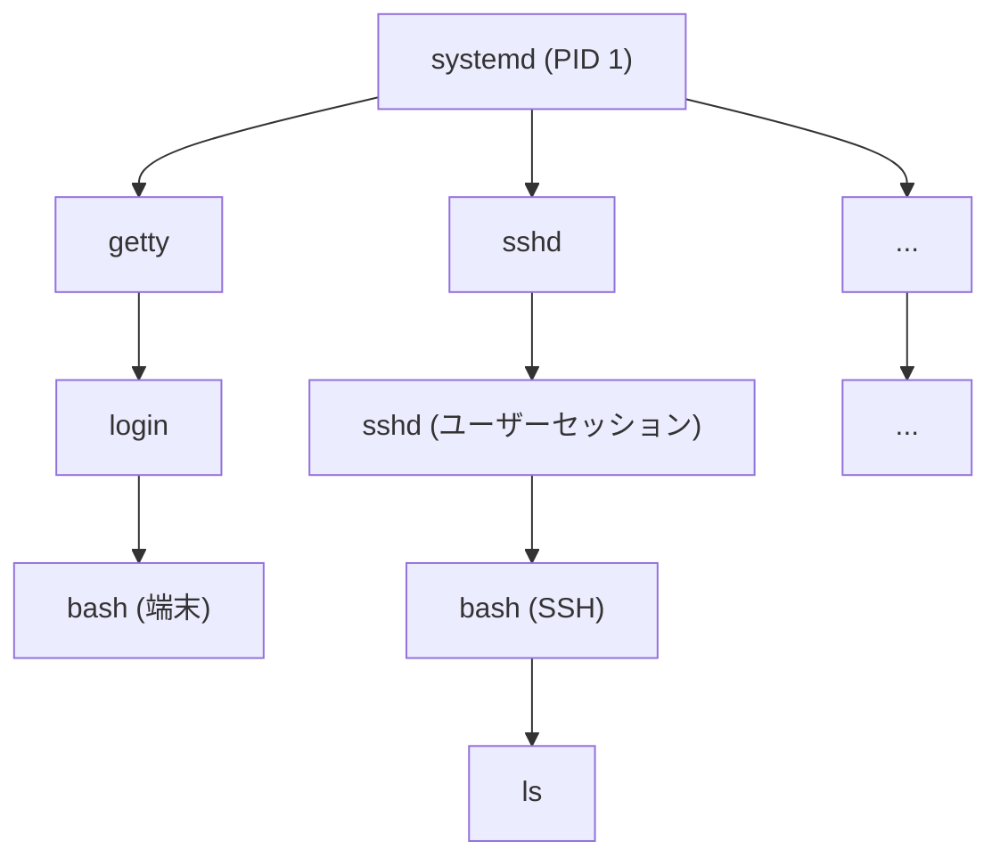

# Linuxの基礎知識

## UNIX系OS

### UNIXとは

### Linuxとは

- オープンソース
- カーネルとディストリビューション
- ディストリビューションの例: Ubuntu、Red Hat Enterprize Linux、CentOS

### 様々なUNIX系OSとPOSIX

- UNIX、Linux、BSD、macOS
- IEEE標準規格 POSIX
- このコースはLinux入門と言いつつUNIX系OSの入門

## シェルの操作

### 様々なシェル

- `sh`、`bash`、`csh`、`zsh`
- このコースでは広く使われるBashのうち共通部分を紹介

### シェルを終了する `exit`

### `Tab` によるコマンド補間

### `ctrl-R` による履歴閲覧

### シェル変数と環境変数

- シェル変数とは
- 環境変数とは
- 違い: 用途、変数の寿命

### 環境変数 `PATH`　とコマンドの呼び出し

- シェルはどうやってコマンドを探し出すか
- `which`、`which -a`

### コマンドに別名をつける `alias`

- 沢山オプションをつけた長いコマンドなどに別の名前をつけたい場合

### 補足: いくつかはシェルの組み込みコマンド

- `cd`、`echo` など
- `type <cmd>` で確認可能

## トラブルシューティング

### コマンドの使い方がわからない時に `man`, `<command> --help`

### エラーを出してみよう

### エラーを読むくせをつける

- エラー文を検索エンジンやAIに入れて聞く
- セキュリティ情報を入力しないように注意
- 一度自分でも読むくせをつけておくと、良く見るエラーはすぐ解決できるようになる

### **演習**: わざと失敗してみよう

- 権限をなくす
- 人のファイルを削除する
- `ssh`にわざと失敗させる

## ファイル・ディレクトリの操作

### Linux では「すべてはファイル」

- VFS (Virtual File System)
- 「すべて」の例

### 今どこにいるの？ `pwd`

- パスの読み方
- 絶対パスと相対パス
- ホームディレクトリ
  - 環境変数 `echo $HOME`
    - 環境変数、`echo`コマンドについては後で改めて説明

### ファイルの一覧を取得 `ls`

- 隠しファイルの取得

### ディレクトリの移動 `cd`

### 標準出力・標準入力・標準エラー出力

- 標準出力へ書き込み `echo`
- Linux では「すべてはファイル」(再)

### パイプとリダイレクト

- UNIXの哲学
- パイプの例
- リダイレクトの例
- **演習**: 回文の表示 (`rev`)

### テキストファイルとバイナリファイル (文字列の表現)

### テキストファイルの編集 `vi`

### テキストファイルの閲覧 `cat, less, head, tail`

### テキストファイルの検索 `grep`

### テキストファイルの置換 `sed`

### ファイル・ディレクトリの容量 `ls -lh`、`du -hs`

- `ls`や`du`のオプション `-h` は human readable

### ファイル・ディレクトリの権限 `ls -l`、`chmod`

### シンボリックリンク `ln -s`

-**演習**: シンボリックリンクを作ってみる

## 時刻と時間

### 現在時刻・日付の表示 `date`、`cal`

### 計測コマンド `time`

### 待機コマンド `sleep`

## プロセス

### Linuxのプロセスツリー

- 親プロセスが必ず存在する
  - 親プロセスの環境変数の引き継ぎ
- `pstree`
- プロセスの例
  - シェル
  - ここまで紹介したコマンドの多く

### フォアグラウンドとバックグラウンドの切り替え `jobs`、`fg`、`bg`、`ctrl-Z`

### リモートでプロセスの実行を続けるには `nohup`、`screen`、`tmux`

### プロセスの操作 `ps`、`kill`

- **演習**: プロセスの生成と削除

## システム情報の取得

### ユーザー情報の取得 `id`、`$HOME`

- 自分自身の情報

### システム情報の取得 `w`、`last`、`top`

### ストレージ情報の取得 `df`、`du`、`ls -l`

- 共有サーバにおけるQUOTA制限

### CIDASシステムにおけるホームディレクトリの容量制限

- CIDASでは以下の容量制限(quota)が存在
  - `scplatform`: 10 MB以下
  - Lustre (`scfront` やIDL・計算ノード): 500 GB以下
    - ホームディレクトリの容量制限に影響されないスクラッチ領域 `/scr/`
- `scfront`上で`uquota.sh -h`等とすると現在の使用量を確認可能
- 詳細は[CIDASシステム利用マニュアル](https://chs.isee.nagoya-u.ac.jp/scwiki/doku.php?id=public:ja:manual:cidas:login)を参照

### 共有サーバ利用の心得

- **演習**: `write` で他のユーザーとお喋り (`mesg`の確認)

## ネットワーク

### ネットワークの階層構造

- IP/TCP
- ドメインネームとIPアドレス

### ISEE内部のネットワーク (資料非公開)

### ネットワークごしのデータコピー

- ネットワークごしのコピー `scp`
- ファイル・ディレクトリのバックアップ `rsync`

### ネットワーク上の情報の取得

- `wget` と `curl`
- **演習**: 天気予報を表示する `curl wttr.in`

### ネットワークごしに複数のコマンドを実行する

- `ssh <server> 'cmd1 ; cmd2 ; cmd3 ; ...'`

## 次のステップ

### ワンライナー 〜複数のコマンドを一行で〜

- `cmd1 ; cmd2 ; cmd3 ; ...`
- `cmd1 && cmd2 && cmd3 && ...`

### シェルスクリプト 〜再現可能なシェル操作〜

- バッチ処理
- ジョブ管理システム
- **演習**: CIDASシステムへのジョブ投入

### タスクランナー `Makefile`

- **演習**: データ処理から画像作成までの自動化

### 仮想化とコンテナ `devcontainer`、`docker`、`apptainer`

- CUIでLinuxを操作する必要性
