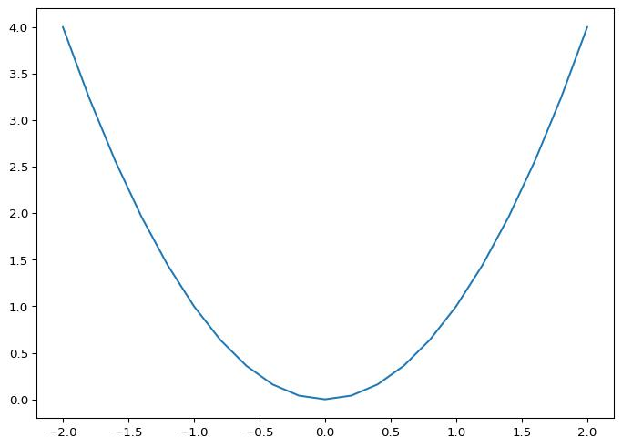
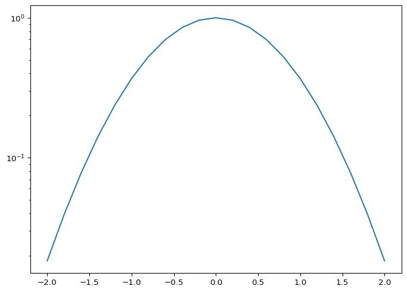
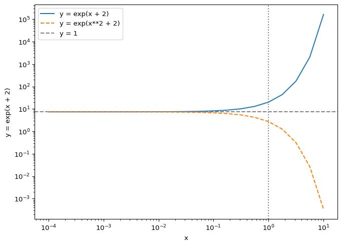

# Python 入門 – ライブラリ

2025-10-15T14:30:39

- [<span class="toc-section-number">1</span> 数値計算ライブラリ
  NumPy](#数値計算ライブラリ-numpy)
- [<span class="toc-section-number">2</span> 可視化ライブラリ
  Matplotlib](#可視化ライブラリ-matplotlib)
- [<span class="toc-section-number">3</span>
  ヘルプとドキュメント](#ヘルプとドキュメント)
- [<span class="toc-section-number">4</span> 練習](#練習-1)

Pythonには非常に様々なライブラリがある。 `import`
文を使ってライブラリを呼び出すことで、各ライブラリが提供する様々な機能を利用することができる。

## 数値計算ライブラリ NumPy

[**NumPy**](https://numpy.org/doc/stable/user/) は Python
で数値計算をする際の代表的なライブラリである。

``` python
import numpy  # NumPyを呼び出し

print(numpy.pi)  # NumPyがもつ定数 pi (円周率) を出力
```

    3.141592653589793

``` python
import numpy as np  # 毎回 numpy.pi と書くと大変なので、 np という別名をつけます

print(np.pi)  # 実行結果は同じです
```

    3.141592653589793

各種初等関数も用意されている。

``` python
print(np.sin(0.5 * np.pi))
print(np.cos(0.5 * np.pi))
print(np.sqrt(2.0))
print(np.exp(1.0))
print(np.log(np.exp(1.0)))
```

    1.0
    6.123233995736766e-17
    1.4142135623730951
    2.718281828459045
    1.0

NumPyが提供する最も重要な機能の一つは(多次元)配列である。
1次元配列は以下のようにして確保できる。

``` python
a = np.zeros(5)  # 長さ 5 の浮動小数点数配列 a の確保
print(a)  # 値は全て 0 に初期化されている

a[0] = 1.0  # 最初の要素に 1 を代入
print(a)

a[2] = 2.0  # 3 番目の要素に 2 を代入
print(a)

a[-1] = 3.0  # 最後の要素に 3 を代入
print(a)
```

    [0. 0. 0. 0. 0.]
    [1. 0. 0. 0. 0.]
    [1. 0. 2. 0. 0.]
    [1. 0. 2. 0. 3.]

``` python
print(type(a))  # 型名
print(len(a))  # 配列 a の長さ
print(a.size)  # 配列 a の要素数
```

    <class 'numpy.ndarray'>
    5
    5

`list` を `np.ndarray` に変換することも出来る。

``` python
a = [1, 2, 3, 4]
print(type(a))
print(a)

b = np.array(a)
# b = np.array([1, 2, 3, 4]) のように直接配列確保・初期化することも可能
print(type(b))
print(b)
```

    <class 'list'>
    [1, 2, 3, 4]
    <class 'numpy.ndarray'>
    [1 2 3 4]

以下の例では、半径 `r` が 0 から 4
まで変化するときに、その面積を配列に保存している。

``` python
n = 5
area = np.zeros(n)

for i in range(0, n):
    area[i] = np.pi * i**2

print(area)
```

    [ 0.          3.14159265 12.56637061 28.27433388 50.26548246]

各要素ごとの演算は `for` 文を使わずに書くことも出来る。

``` python
n = 5
r = np.arange(n)  # r = np.array(range(0, n)) と同様

area = np.pi * r**2
print(area)
```

    [ 0.          3.14159265 12.56637061 28.27433388 50.26548246]

この演習では理解のしやすさのために `for`
文を使って書いてある場合も多い。
しかし、NumPyのライブラリ関数は内部的にコンパイル型言語で書くなど最適化が進んでおり、自分で
`for` 文を書くよりはるかに高速な計算が出来る。
プログラムの実行に時間がかかると感じたら `for`
文に頼らない書き方を学ぶことをおすすめする。

2次元配列は以下のように定義出来る。

``` python
a = np.zeros((3, 4))  # 大きさ 3 x 4 の2次元配列を確保
print(a)

a[0, 0] = 1.0
a[1, 1] = 1.0
a[2, 2] = 1.0
a[2, 3] = 1.0
print(a)
```

    [[0. 0. 0. 0.]
     [0. 0. 0. 0.]
     [0. 0. 0. 0.]]
    [[1. 0. 0. 0.]
     [0. 1. 0. 0.]
     [0. 0. 1. 1.]]

``` python
print(a.ndim)  # 配列 a の次元数
print(a.shape)  # 配列 a の形状
print(len(a))  # 多次元配列 a の「最初の次元の」長さ (注意!)
print(a.size)  # 配列 a の要素数
```

    2
    (3, 4)
    3
    12

このコースでよく使う関数を挙げておこう。 `numpy.max` (`numpy.min`)
は配列の各要素の最大値 (最小値) を返す関数である。

``` python
a = np.array([1.0, 2.0, 3.0, 4.0, 5.0])
print(np.max(a))
```

    5.0

`numpy.sum` は配列の総和を返す関数である。

``` python
a = np.array([1.0, 2.0, 3.0, 4.0, 5.0])
print(np.sum(a))
```

    15.0

座標を定義する場合などは、 `numpy.linspace` を使うと便利である。
例えば、以下では区間 $-1 \le x \le 1$ を 11
等分した配列を作る3通りの方法を示している。

``` python
# numpy.linspace を真似た関数
def linspace(start, stop, num):
    x = np.zeros(num)
    for i in range(num):
        x[i] = start + (stop - start) * i / (num - 1)
    return x


# 方法1: 自作関数を使う場合 (引数をキーワードで指定)
x1 = linspace(start=-1.0, stop=1.0, num=11)

# 方法2: 自作関数を使う場合 (引数を位置で指定)
x2 = linspace(-1.0, 1.0, 11)

# 方法3: numpy.linspace を使う場合
x3 = np.linspace(start=-1.0, stop=1.0, num=11)
# x3 = np.linspace(-1.0, 1.0, 11)  # これでもOK

print("x1: ", x1)
print("x2: ", x2)
print("x3: ", x3)
```

    x1:  [-1.  -0.8 -0.6 -0.4 -0.2  0.   0.2  0.4  0.6  0.8  1. ]
    x2:  [-1.  -0.8 -0.6 -0.4 -0.2  0.   0.2  0.4  0.6  0.8  1. ]
    x3:  [-1.  -0.8 -0.6 -0.4 -0.2  0.   0.2  0.4  0.6  0.8  1. ]

その他にも多くの機能があるため、[NumPyのドキュメント](https://numpy.org/doc/stable/user/)
を参考にして各自調べて欲しい。

## 可視化ライブラリ Matplotlib

[**Matplotlib**](https://matplotlib.org/stable/users/)
を使うと、データをグラフとして描画することができる。

``` python
# ライブラリ Matplotlib のインポート
import matplotlib.pyplot as plt

# x 座標の定義
x = np.linspace(start=-2.0, stop=2.0, num=21)

# y = x**2 の描画
y = x**2
plt.plot(x, y)
plt.show()  # グラフを描画
```



Jupyter Notebook ではセルの区切りで自動で描画されるので、`plt.show()`
が必ず必要な訳では無い。

横軸や縦軸を対数にする場合、以下のようになる。

``` python
# x 座標の定義
x = np.linspace(start=-2.0, stop=2.0, num=21)

# y = exp(-x**2) の描画
y = np.exp(-(x**2))
plt.plot(x, y)
plt.yscale("log")  # y 軸を対数に変更
plt.show()
```



複数の線を書き、それぞれにラベルを付けるなら以下のようになる。
比較のために、定数を描画し、 $x$ 軸、 $y$ 軸の名前も付けてみよう。

``` python
# x 座標の定義 (1.e-2 から 1.e2 まで、対数座標で等間隔に設定)
log10_x = np.linspace(start=-4.0, stop=1.0, num=21)
x = 10.0**log10_x

# 関数の描画
plt.plot(x, np.exp(x + 2), label="y = exp(x + 2)")
plt.plot(x, np.exp(-x + 2), label="y = exp(x**2 + 2)")

# 定数の描画
plt.axhline(y=np.exp(2), color="gray", linestyle="--", label="y = 1")
plt.axvline(x=1.0, color="gray", linestyle=":")  # label を指定しないと凡例なし

# 関数や定数の凡例 (label=~ で指定したテキスト、ラベル) の出力
plt.legend()

# 軸のスケール変更
plt.yscale("log")  # y 軸を対数に変更
plt.xscale("log")  # x 軸を対数に変更

# 軸の名前変更
plt.xlabel("x")  # x 軸に名前を設定
plt.ylabel("y = exp(x + 2)")  # y 軸に名前を設定

plt.show()
```



その他にも多くの機能があるため、[Matplotlibのドキュメント](https://matplotlib.org/stable/users/)
を参考にして各自調べて欲しい。

### 練習

1.  区間 $0 \le x \le 2\pi$ を 100 分割し、配列 `x` を作成せよ。
2.  配列 `y = np.sin(x)` を計算し、ラベルを `"y = sin(x)"`
    としてグラフを描画せよ。
3.  配列 `y = np.cos(x)` を計算し、ラベルを `"y = cos(x)"`
    として重ねて描画せよ。
4.  $y = \pm 1$ および $x = \pi$ の定数を重ねて描画せよ。

``` python
# ここに自分の解答を入力
```

## ヘルプとドキュメント

Pythonでは `help`
と呼ばれる組み込み関数により、関数や変数の利用方法に関するドキュメントを閲覧することが出来る。

``` python
help(print)
```

    Help on built-in function print in module builtins:

    print(*args, sep=' ', end='\n', file=None, flush=False)
        Prints the values to a stream, or to sys.stdout by default.

        sep
          string inserted between values, default a space.
        end
          string appended after the last value, default a newline.
        file
          a file-like object (stream); defaults to the current sys.stdout.
        flush
          whether to forcibly flush the stream.

[Pythonの公式ドキュメント](https://docs.python.org/ja/3/)は日本語でも整備されており、チュートリアルやライブラリリファレンスなどの網羅的な解説を閲覧出来る。
同様に、
[NumPy](https://numpy.org/doc/stable/user/)や[Matplotlib](https://matplotlib.org/stable/users/)などのライブラリも公式ドキュメントが整備されている。
Pythonのライブラリは数多くあるがドキュメントの書かれ方はどれも同様である。
実装に迷ったら適宜参照し、ドキュメントを読む力を養うと良い。

## 練習

Python公式ドキュメント内の[Python チュートリアル \>\> 15.
浮動小数点演算、その問題と制限](https://docs.python.org/ja/3/tutorial/floatingpoint.html)を読み、`a = 1.0`
と `b = 0.1 + 0.1 + 0.1 + 0.1 + 0.1 + 0.1 + 0.1 + 0.1 + 0.1 + 0.1`
のそれぞれを、有効桁数20桁で出力せよ。

``` python
# ここに自分の解答を入力
```
